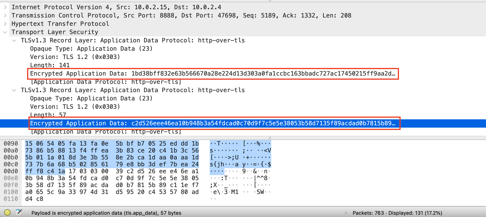

# HTTP代理服务器实验

## 实验目的

验证：在Kali Linux中安装tinyproxy，在主机设置浏览器代理指向tinyproxy建立的HTTP正向代理，在Kali中用Wireshark 抓包，分析抓包过程，理解HTTP正向代理HTTPS流量的特点。

## 实验环境

* 宿主机：macOS Monterey

* 虚拟机
  * 攻击者主机Kali-attacker：Kali Rolling 2022
  * 网关GW-Debian10：Debian buster10
  * 靶机（Kali-victim-1)：Kali Rolling 2022

## 实验步骤

**1.根据网络拓扑测试网络连通性**

* 各节点IP地址

|     节点      |          ip地址           |
| :-----------: | :-----------------------: |
| Kali-attacker |         10.0.2.4          |
| Kali-victim-1 |      172.16.111.145       |
|  GW-Debian10  | 10.0.2.15<br>172.16.111.1 |

* 网络拓扑图

​		

**2.Gateway配置tinyproxy**

```shell
# 安装tinyproxy
apt-get update 
apt-get install tinyproxy

# 编辑tinyproxy配置文件，取消Allow 10.0.0.0/8行首注释
vim /etc/tinyproxy/tinyproxy.conf

# 开启tinyproxy服务
systemctl start tinyproxy
```

* 修改配置文件

  

**3.攻击者主机配置代理**

* 首先打开Kali-attacker的Firefox，按照`Open Application Menu->Settings->Network Settings->Settings`的顺序进入代理配置，然后将`Configure Proxy Access to the Internet`选项选为`Manual proxy configuration`进行手动配置

​		

**4.使用代理服务器访问靶机**

* 在攻击者主机配置好代理服务器后分别在攻击者主机、靶机上开启`wireshark`进行抓包

* 在攻击者主机的Firefox浏览器上访问靶机地址`172.16.111.145`

  * 攻击者主机

    * 攻击者主机访问靶机IP地址`172.16.111.145`后，网页显示Apache2默认页面，攻击者主机访问`172.16.111.145/hack`后显示404 not found，并没有显示代理服务器的信息。

      

      

    * 分析流量发现HTTP响应中包含`via`字段，说明此时攻击者主机想要访问靶机需要经过tinyproxy，此时网关提供代理服务。

      

  * 靶机

    * 对靶机抓包得到的流量进行分析，同样也在HTTP响应中发现了`via`字段，说明此时网关提供了代理服务，此时攻击者主机的IP等信息都没有暴露。

      


**5.使用tinyproxy访问HTTPS站点**

* 在网关GW-Debian上开启`wireshark`进行抓包

* 在攻击者主机`kali-attacker`上使用Firefox 访问`https://www.baidu.com`

* 分析抓包数据：

  

  

  过滤`wireshark`中的数据，`http.request.method eq GET`并没有返回任何数据。此时http过滤后通信内容被加密。`http.request.method eq CONNECT`返回了所有HTTPS代理请求，请求包含所访问的所有站点。

​		可以看到使用https时代理服务器可以看到用户访问的网址，但是客户端和服务器之间传输的数据被加密了。

## 实验总结

* 代理服务器不知道客户端和服务器的HTTPS通信内容，但是存在实现中间人攻击的可能

* 代理服务器知道客户端访问了哪个HTTPS站点
* 代理客户端会发送Connect请求到http代理服务器

## 遇到的问题

**遇到的问题1：**

在网关中配置好tinyporxy之后，在攻击者主机的firefox中配置代理，然后访问靶机的IP地址，通过wireshark抓包后在HTTP响应头中找不到`via`字段并没有指向tinyproxy，说明网关并没有提供代理服务，也就说请求攻击者主机访问靶机时的请求消息可能并没有途径网关。

**解决办法：**

* 使用`systemctl status tinyproxy`检查了一下，tingproxy是启动状态。
* 检查攻击者主机上的代理配置，IP和端口都没有问题。
* 排除以上两种可能的错误之后按照网络拓扑图检测了一下网络连通性，发现靶机无法ping通攻击者主机，但是按照第一章实验要求，靶机是可以直接访问攻击者主机的。想到前两天因为kali-attacker总是闪退所以把它重装了一下，可能重装时没有按照网络拓扑图重新配置好，重新搭建后再次测试发现连通性正常了。再次使用攻击者主机访问靶机，`via`字段指向tinyproxy。

## 参考链接

[中传信安课程网站- HTTP代理服务器实验](https://c4pr1c3.github.io/cuc-ns/chap0x03/exp.html)

[使用HTTP代理服务器的安全性简评](https://www.williamlong.info/archives/2210.html)

[CUCCS/2021-ns-public-Lychee00](https://github.com/CUCCS/2021-ns-public-Lychee00/blob/chap0x03/chap0x03/report03.md)

