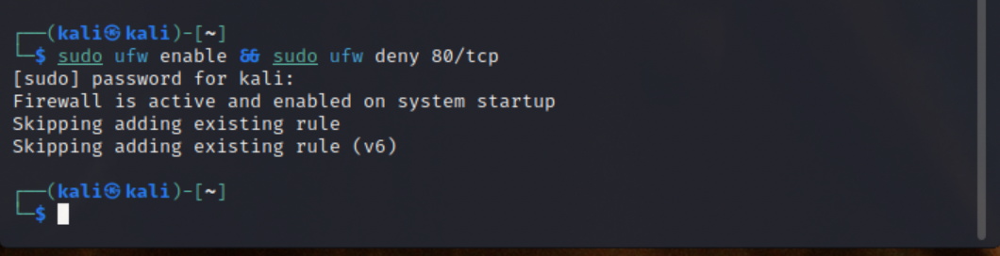
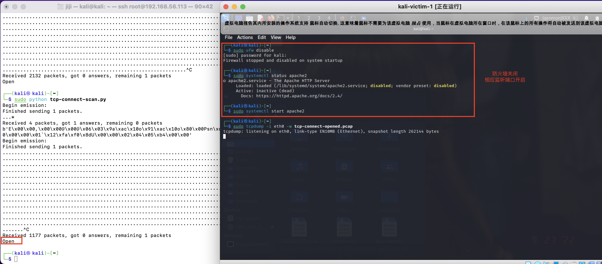
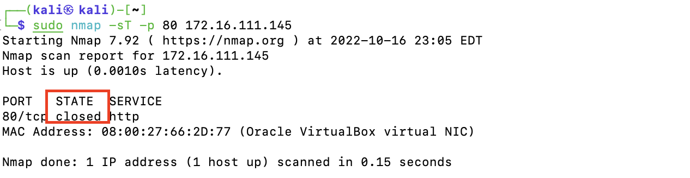

# 基于Scapy编写端口扫描器

## 实验目的

* 掌握网络扫描之端口状态探测的基本原理

## 实验环境

* python+scapy

## 实验要求

- [x] 禁止探测互联网上的 IP ，严格遵守网络安全相关法律法规
- [x] 完成以下扫描技术编程实现
  * TCP connect scan / TCP stealth scan
  * TCP Xmas scan / TCP fin scan / TCP null scan
  * UDP scan

- [x] 上述每种扫描技术的实现测试均需要测试端口状态为：`开放`、`关闭` 和 `过滤` 状态时的程序执行结果
- [x] 提供每一次扫描测试的抓包结果并分析与课本中的扫描方法原理是否相符？如果不同，试分析原因；
- [x] 在实验报告中详细说明实验网络环境拓扑、被测试 IP 的端口状态是如何模拟的
- [x] （可选）复刻 `nmap` 的上述扫描技术实现的命令行参数开关

## 实验过程

### 网络拓扑


### 端口状态设置

* 查看当前防火墙的状态和现有规则

  ```html
  ufw status
  ```

* 端口关闭状态：对应端口不开启监听，防火墙关闭。

  ```html
  ufw disable
  ```

* 端口开启状态：对应端口开启监听，防火墙关闭。

  * Apache2 基于TCP，在80端口提供服务；

  * Dnsmasq 基于UDP，在53端口提供服务；

    ```html
    systemctl start apache2
    systemctl start dnsmasq
    ```

* 端口过滤状态：对应端口开启监听，防火墙开启。

  ```html
  ufw enable && systemctl start apache2
  ufw enable && systemctl start dnsmasq
  ```

### 扫描技术端口实现

#### TCP connect scan

> 使用Connect()调用，使用最基本的TCP三次握手链接建立机制，建立一个目标链接到主机的特定端口上。首先发送方发送一个SYN数据包到目标主机的特定端口，然后可以根据接收包的情况对端口进行判断。

##### 实验代码

```bash
from scapy.all import *
import logging
logging.getLogger("scapy.runtime").setLevel(logging.ERROR)

src_port = RandShort()
dst_ip = "172.16.111.145"
src_ip= "172.16.111.128"
dst_port = 80

resp = sr1(IP(src=src_ip,dst=dst_ip)/TCP(sport=src_port,dport=dst_port,flags="S"),timeout=10)
# print(resp)


if resp is None:
    print("Filtered")

elif (resp.haslayer(TCP)):
    if (resp.getlayer(TCP).flags == 0x14):   
        print ("Closed")
    elif(resp.getlayer(TCP).flags == 0x12): 
        send_rst = sr(IP(dst=dst_ip)/TCP(sport=src_port,dport=dst_port,flags="AR"),timeout=10)
        print ("Open")
```

* **端口关闭**

  * 首先，确保对应端口没有开启监听且防火墙关闭。

    

  * 然后，在攻击者主机中运行代码`sudo python tcp-connect-scan.py`并在靶机中使用`tcpdump -i eth0 -w tcp-connect-closed.pcap`进行抓包

    

    发出数据包后返回`closed`

    

    

    分析抓包结果，攻击者主机发送`SYN`数据包到靶机，靶机回复了一个`RST/ACK`数据包，说明此时端口关闭。

  * 使用`nmap`复刻结果，`nmap-sT -p 80 -n vv 172.16.111.145`

    

    可以看到结果一致。

* **端口过滤**

  * 首先确保对应端口开启监听并且防火墙开启

    

  * 然后在攻击者主机运行代码并在靶机上抓包

    

    分析抓包结果，可以看到靶机并没有给发送数据包的攻击者主机返回任何响应，说明此时端口处于过滤状态。

  * 然后使用`nmap`进行复刻，结果如下：

    

* **端口开放**

  * 首先确保此时对应的端口开启监听，并且防火墙开启

    

  * 靶机抓包，攻击者主机运行代码

    

    此时代码运行结果显示`open`

    

    分析抓包结果，可以看到靶机返回了一个`SYN/ACK`响应，说明此时端口开放。

#### TCP stealth scan

>发送端发送SYN包，如果接收到RST/ACK包表明目标端口关闭；如果是过滤状态则无响应；如果是开放状态在收到SYN/ACK包发送一个RST包立刻拆除连接，不建立完整的TCP连接。

##### 实现代码

```bash
#! /usr/bin/python
import logging
logging.getLogger("scapy.runtime").setLevel(logging.ERROR)
from scapy.all import *
 
dst_ip = "172.16.111.145"
src_port = RandShort()
dst_port=80
 
stealth_scan_resp = sr1(IP(dst=dst_ip)/TCP(sport=src_port,dport=dst_port,flags="S"),timeout=10)
if stealth_scan_resp is None:
    print ("Filtered")
elif(stealth_scan_resp.haslayer(TCP)):
    if(stealth_scan_resp.getlayer(TCP).flags == 0x12):
        send_rst = sr(IP(dst=dst_ip)/TCP(sport=src_port,dport=dst_port,flags="R"),timeout=10)
        print ("Open")
    elif (stealth_scan_resp.getlayer(TCP).flags == 0x14):
        print ("Closed")
elif(stealth_scan_resp.haslayer(ICMP)):
    if(int(stealth_scan_resp.getlayer(ICMP).type)==3 and int(stealth_scan_resp.getlayer(ICMP).code) in [1,2,3,9,10,13]):
        print ("Filtered </type 'nonetype'>")
```

* **端口关闭**

  * 关闭监听服务关闭防火墙，攻击者主机运行代码靶机抓包

  * 抓包结果

    攻击者主机发送`SYN`，靶机回复`RST/ACK`断开连接。

    

    

  * `nmap`复刻

    

* **端口过滤**

  * 监听服务开启，防火墙开启

    

  * 抓包结果

    攻击者主机发送`SYN`，靶机无响应。

    

  * `nmap`复刻

    

* **端口开放**

  * 开启监听服务，防火墙关闭

    

  * 分析抓包结果

    攻击者主机发送`SYN`，靶机回复`SYN/ACK`后TCP断开连接。

    

    

    

  * `nmap`复刻

    

#### TCP Xmas scan

> Xmas发送一个TCP包，并对TCP报文头FIN、URG和PUSH标记进行设置。若端口关闭则相应RST报文；开放和过滤状态下端口无响应。

##### 实现代码

```bash
#! /usr/bin/python

import logging
logging.getLogger("scapy.runtime").setLevel(logging.ERROR)
from scapy.all import *

dst_ip = "172.16.111.145"
src_port = RandShort()
dst_port=80

xmas_scan_resp = sr1(IP(dst=dst_ip)/TCP(dport=dst_port,flags="FPU"),timeout=10)
if xmas_scan_resp is None:
    print("Open|Filtered")
elif(xmas_scan_resp.haslayer(TCP)):
    print("Closed")
elif(xmas_scan_resp.haslayer(ICMP)):
    if(int(xmas_scan_resp.getlayer(ICMP).type)==3 and int(xmas_scan_resp.getlayer(ICMP).code) in [1,2,3,9,10,13]):
        print("Filtered")
```

* **端口关闭**

  * 防火墙关闭且相应的监听端口关闭

    

  * 分析抓包数据

    攻击者主机发送了`FIN、URG、PUSH`标记的报文头，接收端回复了一个`RST`报文

    

  * `nmap`复刻

    

* **端口过滤**

  * 防火墙开启且相应的端口开启监听

    

  * 分析抓包数据

    端口无响应

    

  * `nmap`复刻

    

* **端口开放**

  * 防火墙关闭且相应的端口开启监听

    

  * 分析抓包结果

    无响应

    

  * `nmap`复刻

    

#### TCP fin sacn

> 发送端仅发送`FIN`，`FIN`包可以直接通过防火墙。如果端口关闭，会回复一个`RST`包；如果端口过滤或者开放，则对于`FIN`包无响应

##### 代码实现

```bash 
#! /usr/bin/python
 
import logging
logging.getLogger("scapy.runtime").setLevel(logging.ERROR)
from scapy.all import *

dst_ip = "172.16.111.145"
src_port = RandShort()
dst_port=80

fin_scan_resp = sr1(IP(dst=dst_ip)/TCP(dport=dst_port,flags="F"),timeout=10)
if fin_scan_resp is None:
    print ("Open|Filtered")
elif(fin_scan_resp.haslayer(TCP)):
    if(fin_scan_resp.getlayer(TCP).flags == 0x14):
        print ("Closed")
elif(fin_scan_resp.haslayer(ICMP)):
    if(int(fin_scan_resp.getlayer(ICMP).type)==3 and int(fin_scan_resp.getlayer(ICMP).code) in [1,2,3,9,10,13]):
        print ("Filtered</type 'nonetype'>")
```

* **端口关闭**

  * 确认端口状态

    

  * 分析抓包结果

    返回了一个`RST/ACK`数据包

    

  * `nmap`复刻

    

* **端口过滤**

  * 确认端口状态

    

  * 分析抓包结果

    无响应

    

  * `nmap`复刻

    

* **端口开放**

  * 确认端口状态

    

  * 分析抓包结果

    无响应

    

  * `nmap`复刻

    

#### TCP null scan

> 会发送一个`TCP`数据包，并且关闭所有TCP报文头。若端口关闭则会回复一个`RST`数据包；若端口过滤或者开放则无响应。隐蔽性更好但是需要自己构造数据包。

##### 代码实现

```bash
#! /usr/bin/python
 
import logging
logging.getLogger("scapy.runtime").setLevel(logging.ERROR)
from scapy.all import *

dst_ip = "172.16.111.145"
src_port = RandShort()
dst_port=80

null_scan_resp = sr1(IP(dst=dst_ip)/TCP(dport=dst_port,flags=""),timeout=10)
if null_scan_resp is None:
    print ("Open|Filtered")
elif(null_scan_resp.haslayer(TCP)):
    if(null_scan_resp.getlayer(TCP).flags == 0x14):
        print ("Closed")
elif(null_scan_resp.haslayer(ICMP)):
    if(int(null_scan_resp.getlayer(ICMP).type)==3 and int(null_scan_resp.getlayer(ICMP).code) in [1,2,3,9,10,13]):
        print ("Filtered</type 'nonetype'>")
```

* **端口关闭**

  * 确认端口状态

    

  * 分析抓包结果

    发送的`TCP`报文头为空，返回了`RST/ACK`数据包

    

  * `nmap`复刻

    

* **端口过滤**

  * 确认端口状态

    

  * 分析抓包结果

    发送了一个报文头为空的`tcp`报文且没有收到响应

    

  * `nmap`复刻

    

* **端口开放**

  * 确认端口状态

    

  * 分析抓包结果

    同过滤状态，无响应。

    

  * `nmap`复刻

    

#### UDP scan

> UDP是一个无链接协议，当我们向目标主机的UDP端口发送数据时并不能收到开放端的确认信息。在大多数情况向，向UDP端口发送数据，如果端口关闭，则返回`(ICMP_PORT_UNREACHABLE`的报错；如果端口打开，则端口无响应；过滤状态下发出的UDP数据包也可能得不到任何回应。

##### 代码实现

```bash
#! /usr/bin/python

import logging
logging.getLogger("scapy.runtime").setLevel(logging.ERROR)
from scapy.all import *

dst_ip = "172.16.111.145"
src_port = RandShort()
dst_port= 53
dst_timeout=10

def udp_scan(dst_ip,dst_port,dst_timeout):
    udp_scan_resp = sr1(IP(dst=dst_ip)/UDP(dport=dst_port),timeout=dst_timeout)
    if udp_scan_resp is None: #no response
        print("opened|flitered")
    elif (udp_scan_resp.haslayer(UDP)): # response  open
        print("open")
    elif(udp_scan_resp.haslayer(ICMP)): # response icmp
        if(int(udp_scan_resp.getlayer(ICMP).type)==3 and int(udp_scan_resp.getlayer(ICMP).code)==3):#desination unreachable
            print("closed")
        elif(int(udp_scan_resp.getlayer(ICMP).type)==3 and int(udp_scan_resp.getlayer(ICMP).code) in [1,2,9,10,13]):#filter
            print("closed")
    else:
        print(str(type(udp_scan_resp)))


udp_scan(dst_ip,dst_port,dst_timeout)
```

* **端口关闭**

  * 确认端口状态

    

  * 分析抓包数据

    显示`ICMP`不可达

    

  * `nmap`复刻，`nmap -sU -p 53 172.16.111.145`

    

* **端口过滤**

  * 确认端口状态

    

  * 分析抓包数据

    无响应

    

  * `nmap`复刻，`nmap -sU -p 53 172.16.111.145`

    因为此时防火墙开启且无响应，所以`nmap`复刻结果可能是`open`或者`filter`状态

    

* **端口开放**

  * 确认端口状态

    

  * 分析抓包数据

    无响应

    

  * `nmap`复刻，`nmap -sU -p 53 172.16.111.145`

    

## 实验总结

**遇到的问题**

1. 在完成UDP scan的编程实现时，使用nmap复刻扫描时，复刻结果和扫描结果不一致。扫描结果显示的是`opened|filtered`，但是复刻结果却是`closed`。

   **解决办法：**之前使用的`-sT`是针对TCP端口的扫描，使用`-sU`可以对特定目标执行UDP端口扫描，把原先的命令修改为` nmap -sU -p 53 172.16.111.145`即可。

2. 在本地使用`ssh`连接虚拟机时出现输入ssh口令一直无响应，直至`timed out`的问题

   **解决办法：**在搜索引擎上搜索，有一篇[文章](https://blog.csdn.net/weixin_43941364/article/details/118179717)给的解答是可以尝试关掉防火墙，考虑到这次实验需要不断开启和关闭防火墙，我猜测就是防火墙的原因，使用`sudo ufw disable`关闭防火墙后，ssh登录成功。

## 参考资料

* [ssh: connect to host ip port 22: Connection timed out](https://blog.csdn.net/weixin_43941364/article/details/118179717)

* [第五章 网络扫描](https://c4pr1c3.gitee.io/cuc-ns/chap0x05/main.html)

* [nmap详细使用教程](https://blog.csdn.net/smli_ng/article/details/105964486)

* [如何使用Scapy写一个端口扫描器](https://blog.csdn.net/think_ycx/article/details/50898096)
* [2021-ns-public-Lychee00/chap0x05](https://github.com/CUCCS/2021-ns-public-Lychee00/blob/chap0x05/chap0x05/report05.md)